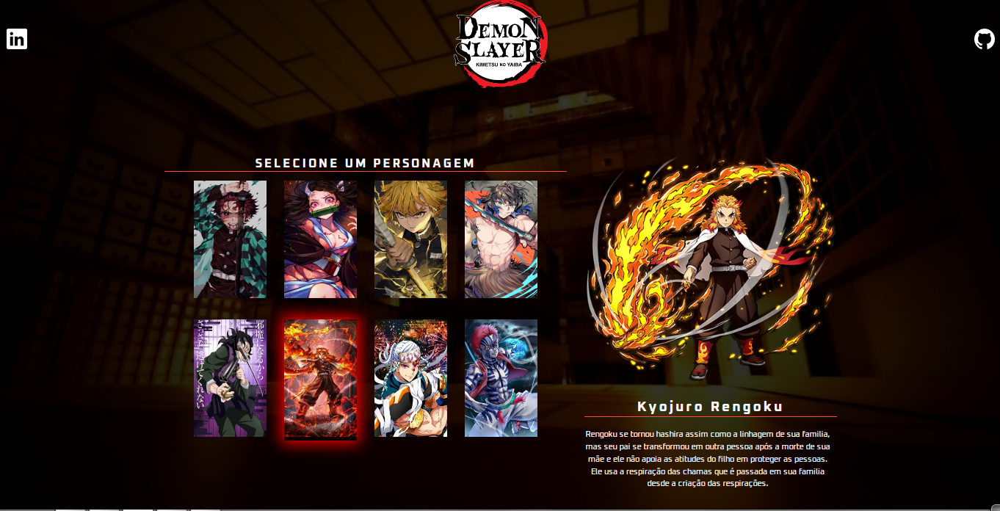

<h1 align="center"> Projeto Kimetsu no Yaiba </h1>

Evento Semana do zero ao Programador Contratado com Rodrigo e Ricardo. (DEV EM DOBRO)

  <a href="#-tecnologias">Tecnologias</a>&nbsp;&nbsp;&nbsp;|&nbsp;&nbsp;&nbsp;
  <a href="#-projeto">Projeto</a>&nbsp;&nbsp;&nbsp; 

 

  

## 🚀 Tecnologias

Esse projeto foi desenvolvido com as seguintes tecnologias:

- HTML e CSS
- JavaScript
- Git e Github

## 💻 Projeto

O projeto Kimetsu é uma página de "seleção de personagem".

---

Feito com ♥ by Ricardo.